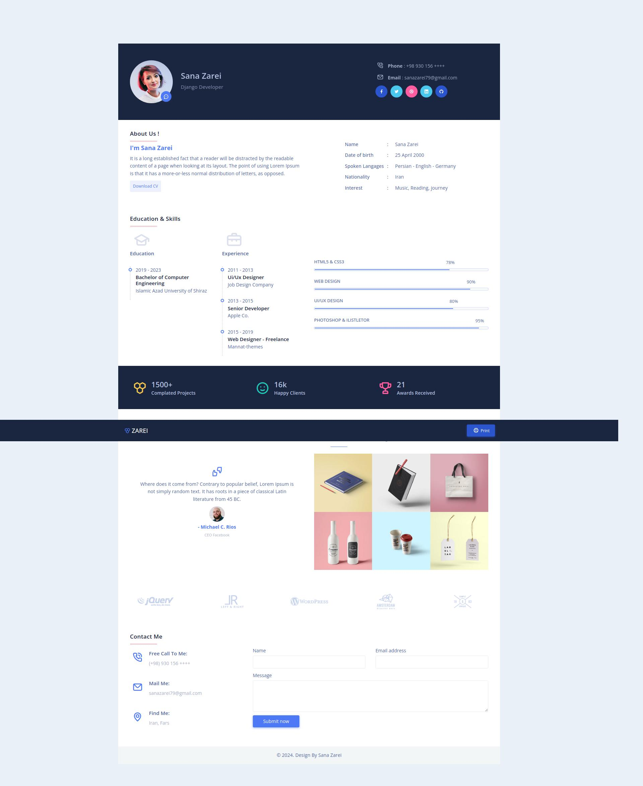
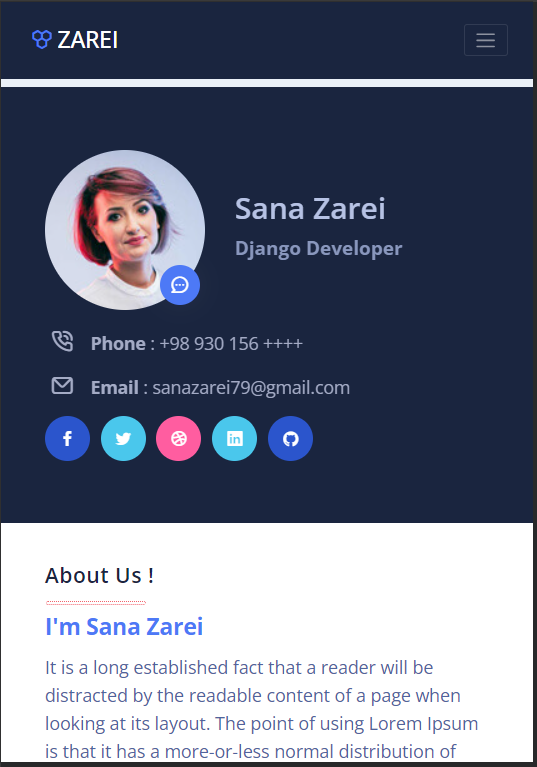

# Responsive Resume Sana Zarei
### Responsive Resume Sana Zarei

- Responsive Resume Cv Website Using HTML CSS And JavaScript
- Contains a mobile navigation with icons
- Smooth scrolling in each section in mobile version
- Print Button

**To Do List :**
<ul style="list-style-type:none;">
    <li><input type="checkbox" checked disabled> - [x] Publish Initial Version of the Website </li>
    <li><input type="checkbox" checked> - [ ] Make Better Print Output </li>
    <li><input type="checkbox" checked> - [ ] Optimize for SEO </li>
    <li><input type="checkbox" checked> - [ ] Optimize Performance </li>
    <li><input type="checkbox" checked> - [ ] Regularly Update Content </li>
</ul>

  <strong>Desktop Mode</strong>

  

  <strong>Phone Mode</strong>

  

